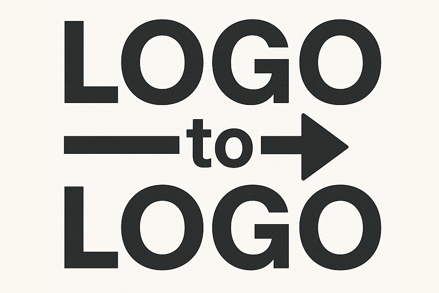
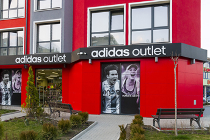
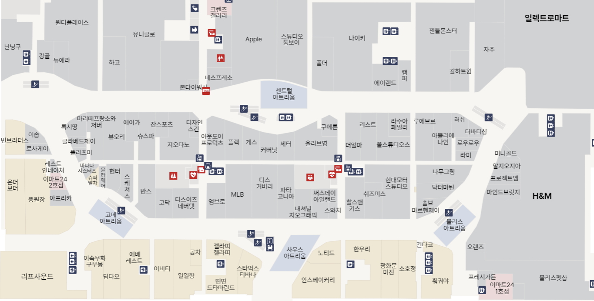
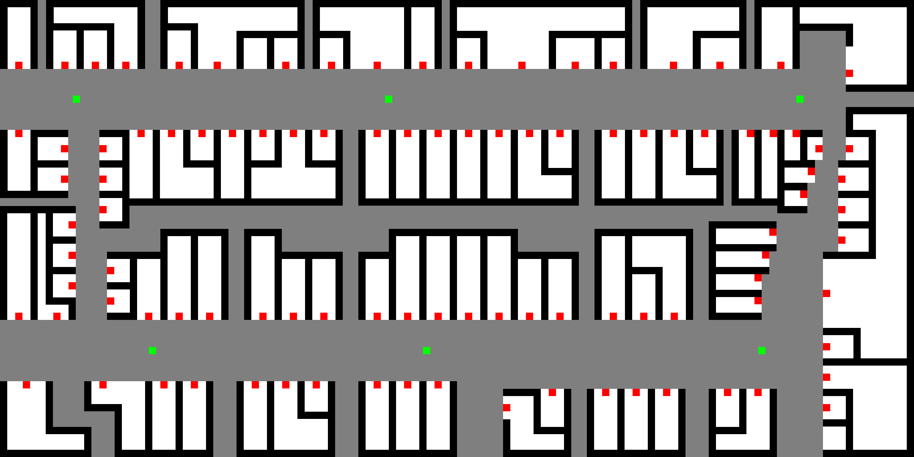
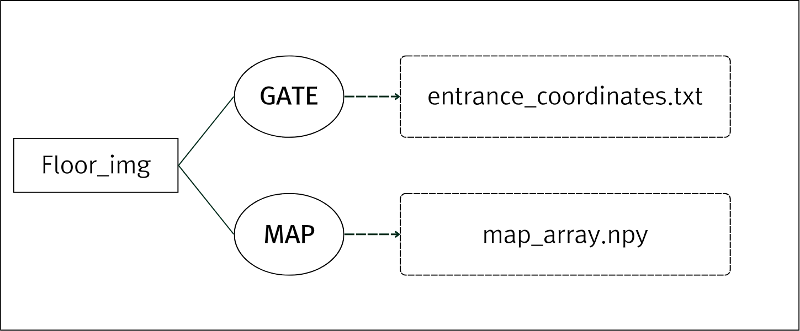
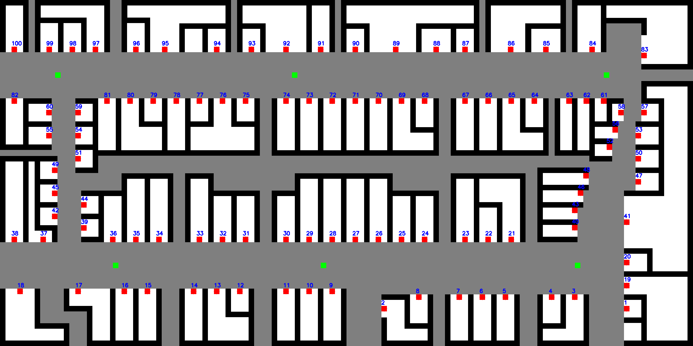
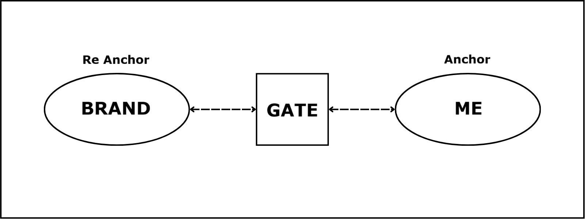
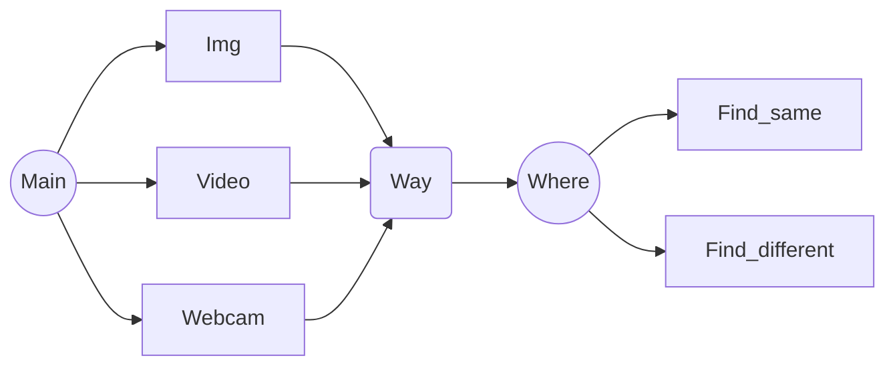

# LOGO to LOGO



**OpenCV, YOLO 기반 로고 탐지 + 매장 위치 안내 GUI를 구현한 프로젝트**

## 소개
이 프로그램은 **OpenCV**와 **YOLO**를 이용하여 브랜드들의 로고를 인식하고 <br>

지도상에서 해당 사용자의 위치를 표시하고 원하는 브랜드 매장으로 길안내 프로그램입니다. <br>

이 프로젝트에서는 하남 스타필드 매장 구조와 입점한 브랜드들을 이용했습니다.<br>

---
## 📚 목차 (Table of Contents)
- [프로젝트 개요](#-프로젝트-개요)
- [1️⃣ YOLO 학습 과정](#1️⃣-yolo-학습-과정)
  - [1-1. 모델 선택 이유](#-1-1-모델-선택-이유)
  - [1-2. 학습 데이터 생성](#-1-2-학습-데이터-생성)
  - [1-3. YOLO 학습 방식](#-1-3-YOLO-학습-방식)
  - [1-4. 파인튜닝 전략](#-1-4-파인튜닝-전략)
- [2️⃣ 프로젝트 주요 기능](#2️⃣-프로젝트-주요-기능)
  - [2-1. 브랜드 로고 탐지](#-2-1-브랜드-로고-탐지)
  - [2-2. 매장 내부 구현 방식](#-2-2-매장-내부-구현-방식)
  - [2-3. 현재 위치 표시](#-2-3-현재-위치-표시)
  - [2-4. 목적지 탐색](#-2-4-목적지-탐색)
  - [2-5. 경로 탐색 및 시각화](#-2-5-경로-탐색-및-시각화)
- [프로젝트 구조](#-프로젝트-구조)
- [기술 스택](#-기술-스택) 
- [실행 화면](#-실행-화면)       
- [달성 성과](#-달성-성과)
---

## 📝 프로젝트 개요

본 프로젝트는 **컴퓨터 비전** 기반 객체 인식 기술과 **경로 탐색 알고리즘(A\*)** 을 결합한 실시간 매장 안내 시스템입니다. <br>

대형 백화점이나 쇼핑몰 내에서 사용자가 안내데스크를 거치지 않고도 <br>

원하는 브랜드 매장이나 현재 위치를 손쉽게 찾을 수 있도록 돕는 실내 안내 시스템입니다. <br>

사용자는 카메라를 통해 이미지나 영상을 촬영하면, 시스템이 이를 분석하여 자동으로 브랜드 **로고를 인식**합니다. <br>

인식된 로고 정보를 바탕으로 사용자의 **현재 위치를 계산**하여 지도 상에 표시합니다. <br>

그후 목적지를 선택하거나 인식시키면, 시스템이 해당 매장까지의 **최적 경로를 탐색**하고 안내합니다.

---

## 1️⃣ YOLO 학습 과정

### 🔧 1-1. 모델 선택 이유

- 왜 **YOLO**인가?

| 아디다스 스포츠 | 아디다스 오리지널스 | 아디다스 매장간판 |
|---------------|----------------|----------------|
|  |  |  |


> 객체 인식 모델은 여러가지가 있지만 위 처럼 서로 다르지만 모두 Adidas로 인식을 하기위해 **YOLO** 모델을 적합하다고 생각했습니다.


- YOLOv8은 다양한 크기의 모델(n/s/m/l/x)을 제공하며, 본 프로젝트에서는 **YOLOv8s**를 선택했습니다.

| 모델 | 장점 | 단점 |
|------|------|------|
| YOLOv8n | 가장 빠름, 가벼움 | 정확도 낮음 |
| **YOLOv8s** | 속도와 정확도의 균형 | 실시간 탐지에 적합 |
| YOLOv8m/l/x | 정확도 높음 | 추론 속도 느림, 리소스 요구 높음 |

> YOLOv8s는 실내 환경에서도 빠르고 정확한 탐지를 지원하여 선택했습니다.


---
### 📊 1-2. 학습 데이터 생성

- 약 200개 브랜드 로고에 대해 **합성 이미지 생성**
- **데이터 증강법 (data augmentation)**
1. 원본 이미지에서 특징적인 부분 추출
2. 추출한 이미지를 **homography** 를 이용하여상하좌우 왜곡
3. 추출 이미지와 왜곡 이미지를 다양한 배경과 합성 (매장, 거리, 테이블 등)
4. 랜덤 회전(±15°), 확대(1.3–1.5배) 등 적용


| 원본 | 로고 추출 |
|---------------|----------------|
|  |  |

| 시점 왜곡 적용 | 배경 합성 |
|---------------|----------------|
|  |  |

#### 왜곡 - homography.py 

```python
def apply_perspective(img, direction, ratio):
    # direction(top/bottom/left/right)에 따라 원근 변형 좌표 설정
    M = cv2.getPerspectiveTransform(src, dst)  # 변환 행렬 계산
    return cv2.warpPerspective(img, M, (w, h))  # 원근 변형 적용
```
```python
def generate():
    for logo_path in logo_paths:
        cleaned = clean_image(logo_path)  # 메타데이터 제거 및 RGBA 변환
        for direction in DIRECTIONS:
            warped = apply_perspective(logo, direction, ratio)
            cv2.imwrite(..., warped)  # 왜곡된 이미지 저장
```

#### 증강 - augmentation.py
```python
def rotate_image_no_crop(img, angle):
    # 이미지 회전 시 잘리지 않도록 크기 확장 후 회전 적용
    return cv2.warpAffine(img, M, (new_w, new_h))
```
```python
def place_logo_on_background(bg, logo):
    # 로고를 배경 위 무작위 위치에 합성
    # YOLO 형식 라벨 (x_center, y_center, width, height) 반환
    return composite, (x, y, w, h)
```
```python
def generate():
    for cls_name in class_to_images:
        for i in range(num_per_class):
            logo = rotate_image_no_crop(...)
            comp, label = place_logo_on_background(...)
            cv2.imwrite(...); write YOLO label to .txt  # 이미지 저장 및 라벨 작성
```

---
### 🧠 1-3. YOLO 학습 방식

- **YOLOv8s 모델 초기화:** `YOLO('yolov8s.pt')`
- **입력 해상도:** 640x640
- **에폭 수:** 100
- **검증용 데이터:** 클래스별 학습 이미지의 10~20%의 새로운 합성 이미지 생성해서 사용용
- **실제 영상으로 일반화 성능 테스트 수행**
- **YOLO** 학습 명령어 
```python
yolo task=detect mode=train model=yolov8s.pt data=dataset/data.yaml epochs=100 imgsz=640
```
---

### 🤖 1-4. 파인튜닝 전략

- 일부 클래스가 실제 환경에서 탐지 성능 저하 → **클래스별 파인튜닝 수행**
- 기존 모델 유지한 채 **문제 클래스만 실제 로고로 재학습**
- 합성 + 실제 샘플 혼합으로 일반화 성능 개선
- 추후 **새로운 브랜드 학습시** 유용

---

## 2️⃣ 프로젝트 주요 기능

### 👁 2-1. 브랜드 로고 탐지

- 촬영한 이미지나 비디오 혹은 실시간 카메라에서 브랜드 로고 탐지
- **YOLOv8s** 추론 결과 → 탐지된 클래스 ID 획득
- **Tkinter GUI**와 연동하여 로고 인식 결과 전송

---
### 🪄 2-2. 매장 내부 구현 방식

#### 1. 전처리 과정
- 실제 매장 지도를 **고정 해상도 (예: 2400x800)** 로 단순화 및 픽셀화
- 각 픽셀은 **해당 위치의 의미를 가지는 색상**으로 채워짐

| 원본 | 픽셀 단위 단순화 |
|---------------|----------------|
|  |  |

| 지도 배열 및 입구 좌표 추출 |
|---------------|
|  |


#### 2. 입구 좌표 추출 - gate.py 
```python
for cnt in contours:
    M = cv2.moments(cnt)
    cx = int(M["m10"] / M["m00"])
    cy = int(M["m01"] / M["m00"])
    entrance_points.append((cx, cy)
  ...
```
> 각 입구의 **좌표**를 구하고 Y값 기준으로 정렬시킵니다.
```python
cv2.circle(img, (x, y), 10, (0, 0, 255), -1)
cv2.putText(img, str(counter), (x-10, y-15),
            cv2.FONT_HERSHEY_SIMPLEX, 0.6, (255, 0, 0), 2)
```
> 정렬된 입구에 **번호**를 부여하고, 이미지 위에 **빨간 원**과 **파란색**으로 표시합니다.
```python
with open("entrance_coordinates.txt", "w") as f:
    for i, (x, y) in enumerate(entrance_points, 1):
        f.write(f"{i}: ({x}, {y})\n")
```
> 모든 층의 입구 좌표를 모아 `entrance_coordinates.txt`로 저장합니다.

| 입구 번호 표시 |
|---------------|
|  |

#### 3. 매장 내부 인식 및 색상별 구분 - map2.py

| 색상 | 의미 | 설명 |
|------|------|------|
| ⬜ WHITE | 매장 내부 | 각 브랜드 매장이 위치한 셀 |
| ⬛ BLACK | 벽 또는 장애물 | 이동 불가 영역 | 
| 🔲 GRAY | 이동 가능 구역 | 사용자가 자유롭게 이동 가능한 공간 | 
| 🟥 RED | 매장 입구 | 각 매장의 입구 |
| 🟩 GREEN | 에스컬레이터 | 다른층으로 이동하기 위한 영역 |

```python
# 개별 마스크 생성
masks = {}
for color_name, (low, high) in color_ranges.items():
  masks[color_name] = cv2.inRange(img, np.array(low), np.array(high))
  print(f"  {color_name:<6} 검출 완료")

# 이동 불가 = 흰색, 검정, 빨강
blocked = cv2.bitwise_or(masks["WHITE"], masks["BLACK"])
blocked = cv2.bitwise_or(blocked, masks["RED"])

# 이동 가능 = 회색, 초록
walkable = cv2.bitwise_or(masks["GRAY"], masks["GREEN"])

# 최종 맵 (1 = 이동 가능, 0 = 이동 불가능)
map_array = np.where(walkable > 0, 1, 0).astype(np.uint8)
```
> 각층의 이미지를 인식하고 픽셀을 색상별로 0과 1로 구분합니다.
```python
# numpy 파일로 저장
map_path = os.path.join(output_dir, f"map_array_{floor}.npy")
np.save(map_path, map_array)
```
> 그 정보를 `map_array_{floor}.npy`로 저장합니다.
---
### 📌 2-3. 현재 위치 표시

|앵커와 역앵커 구조|
|-----------------|
|  |

- `class2.cell`을 이용한 브랜드 ↔ 매장 ↔ 입구 정보 매핑
- Tkinter로 제작된 GUI 상에 **타원 영역으로 현재 위치 표시**
- `gate2.py`와 `map2.py`를 통해 각 매장의 입구 좌표와 번호 획득 및 사용
- 탐지된 브랜드 → 해당 매장 위치로 자동 포커스

#### 1. 앵커 좌표를 이용해 입구 방향과 위치 계산 - way2.py
```python
# 실행 시 인자로 받은 Gate 번호를 리스트로 저장합니다.
args = sys.argv[1:]
anchor_nums = [int(x) for x in args if x.isdigit()]
```
```python
# Gate 번호에 따라 해당 층(Floor) 을 자동 판별합니다.
def get_floor_from_gate(gate_num):
    if 1 <= gate_num <= 100: return "1F"
    elif 101 <= gate_num <= 178: return "2F"
    else: return "3F"
```
```python
def shifted_anchor(x, y, direction="down"):
    # 입구 방향에 따라 앵커 방향을 설정
    offsets = {"down": 80, "up": 80, "left": 50, "right": 50}
    offset = offsets.get(direction, 0)
    return {
        "down": (x, y + offset),
        "up": (x, y - offset),
        "left": (x - offset, y),
        "right": (x + offset, y),
    }.get(direction, (x, y))
```
> `YOLO_LOGO_{}.py`를 통해 인식된 브랜드들의 **Gate No**와 **Name** 정보 저장하고 사용합니다.
```python
# 여러 입구 좌표 → 앵커 좌표 보정 → 평균 좌표 계산
if selected_anchors:
    avg_x = sum(x for x, _ in selected_anchors) // len(selected_anchors)
    avg_y = sum(y for _, y in selected_anchors) // len(selected_anchors)
elif entrances_current_floor:
    avg_x = sum(x for x, _ in entrances_current_floor) // len(entrances_current_floor)
    avg_y = sum(y for _, y in entrances_current_floor) // len(entrances_current_floor)
else:
    h, w, _ = img.shape
    avg_x, avg_y = w // 2, h // 2
```
> 입구 좌표에서 일정 거리 떨어진 지점인 **앵커**를 이용해서 현재 위치를 계산 및 표시합니다.

#### 2. 역 앵커 좌표이용해서 인식된 브랜드 이름 표시 - way2.py
```python
direction = number_to_way.get(gno, "down")
reverse_dir = {"up": "down", "down": "up", "left": "right", "right": "left"}[direction]
rx, ry = shifted_anchor(x, y, reverse_dir)
```
> 앵커의 반대 방향을 **역앵커** 로 지정하여 해당 좌표에 브랜드 매장명을 표시 했습니다.
---

### 🔎 2-4. 목적지 탐색
- `way2.py`에서 현재 위치와 층 정보를 받아옵니다.
##### 목적지 찾기 - where.py
```python
# 이름으로 찾기
def show_name_selector():
    for widget in root.winfo_children():
        widget.destroy()
        ...
```
```python
# 이미지로 찾기
def show_image_search():
    for widget in root.winfo_children():
        widget.destroy()
        ...
```
> `YOLO_LOGO_img.py`와 동일한 방식으로 **목적지 로고**를 인식합니다.
```python
# ====== finding.py 호출 ======
def go_to_pathfinder(brand_name):
    brand_info = df[df["Name"] == brand_name]
    ...
    # 층별 offset
    if goal_floor == "1F":
        offset = 0
    elif goal_floor == "2F":
        offset = 100
    elif goal_floor == "3F":
        offset = 178
    else:
        offset = 0
    ...
    goal_x, goal_y = entrances[idx]
    print(f"목적지 좌표: ({goal_x}, {goal_y}) / 층: {goal_floor}")

    # ====== 실행할 탐색 파일 선택 ======
    if start_floor == goal_floor:
        finding_file = "find_same.py"
    else:
        finding_file = "find_different.py"
        ...
```
> 목적지의 입구 번호로 층을 알아내고 현재 층과 비교하여 `finding_same.py` 혹은 `finding_different.py` 실행
---

### 🚶 2-5. 경로 탐색 및 시각화
- `map_array_{start_floor}.npy`를 이용해서 이동 경로를 파악합니다.
#### 같은 층에서 이동동 - finding_same.py
```python
start_x, start_y = map(int, sys.argv[1:3])
start_floor = sys.argv[3]
goal_x, goal_y = map(int, sys.argv[4:6])
goal_floor = sys.argv[6]
goal_name = sys.argv[7]
```
> 현재 좌표와 층, 목적지 좌표와 층, 이름을 받아옵니다.
```python
# ====== A* 탐색 (8방향) ======
def astar_path(map_array, start, goal):
    h, w = map_array.shape

    dirs = [
        (-1, 0, 1), (1, 0, 1), (0, -1, 1), (0, 1, 1),
        (-1, -1, 1.414), (1, -1, 1.414), (-1, 1, 1.414), (1, 1, 1.414)
    ]

    def heuristic(a, b):
        return np.hypot(a[0] - b[0], a[1] - b[1])

    open_set = []
    heapq.heappush(open_set, (heuristic(start, goal), 0, start))
    came_from = {}
    g_score = {start: 0}

    while open_set:
        _, cost, current = heapq.heappop(open_set)
        if current == goal:
            break
        ...
            new_cost = g_score[current] + move_cost
            neighbor = (nx, ny)
            if neighbor not in g_score or new_cost < g_score[neighbor]:
                g_score[neighbor] = new_cost
                f_score = new_cost + heuristic(neighbor, goal)
                heapq.heappush(open_set, (f_score, new_cost, neighbor))
                came_from[neighbor] = current
```
> `map_array_{start_floor}.npy`와 A* 알고리즘 를 이용해서 목적지 까지의 최적 경로를 계산합니다.

#### 다른 층으로 이동 - finding_different.py
```python
기본적인 기능은 `finding_same.py`와 동일합니다.
```
```python
    ...
    if (start_floor in ["1F", "2F"] and goal_floor == "3F") or \
       (start_floor == "3F" and goal_floor in ["1F", "2F"]):
        valid_indices = range(0, min(3, total_start, total_goal))
    else:
        valid_indices = range(0, min(6, total_start, total_goal))

    allowed_escalators = [escalators_start[i] for i in valid_indices]
    distances = [((e[0]-start_x)**2 + (e[1]-start_y)**2) for e in allowed_escalators]
    closest_index_in_allowed = int(np.argmin(distances))
    chosen_index = valid_indices[closest_index_in_allowed]
    ...
```
- 현재 위치 와 목적지 근처 **에스컬레이터**를 확인 후 쌍을 선택하여 경로를 탐색합니다
- 1층 ↔ 2층 1~6번 **에스컬레이터** 번호에 맞게 쌍 선택
- 1층 or 2층 ↔ 3층 일 경우 1~3번 **에스컬레이터**만 번호에 맞게 쌍 선택 

```python
def toggle_floor(event=None):
    current_floor[0] = 1 - current_floor[0]
    show_image(current_floor[0])

canvas.bind("<Button-1>", toggle_floor)
```
> **Tkinter** 윈도우의 지도를 클릭하면 현재 층에서 목적지 층의 이미지로 바뀝니다.

## 📂 프로젝트 구조


```plaintext
├── LOGO to LOGO/
│   ├── codes/
│   |     ├── main2.py
│   |     ├── YOLO_LOGO_img2.py
│   |     ├── YOLO_LOGO_video2.py
│   |     ├── YOLO_LOGO_webcam2.py
│   |     ├── way2.py
│   |     ├── where.py
│   |     ├── finding_same.py
│   |     ├── finding_different.py
│   |     └── ...
│   ├── images/
│   |     ├── starfield 1F~3F.png
│   |     ├── title.png
│   |     └── logo/
|   |          ├── adidas1.png
|   |          ├── starbucks.png
|   |          └── ...
|   ├── cells/
│   |     └── class2.cell
|   ├── txts/
│   |     ├── entrance_coordinates.txt
│   |     └── map_array.npy         
│   └── best.pt 
```

---
## 🛠 기술 스택

| 기술 스택 | 분야 |
|-----------|------|
|  | 사용 언어 |
|  | 데이터 증강 |
|  | 객체 인식 |
|  | 객체 인식 |
|  | GUI |

---

## 🎥 실행 화면
||
|-----------|
| 이미지 인식 |

-비디오 인식

-내 위치 표시

-같은 층에서 길찾기

-다른 층에서 길찾기

---

## 🏆 달성 성과

- 약 200개 가량의 브랜드 로고를 **인식** (합성 + 실제 촬영 데이터 기준)
- 촬영 영상 내에서 **인식된 브랜드**의 매장 위치를 GUI 상에서 정확하게 **포인팅**
- 여러 브랜드들을 인식했을 경우 **각 매장의 앵커 좌표를 계산하여 현재 위치 표시** 구현
- 인식된 브랜드들의 매장명을 **역 앵커를 이용**해서 표시
- 1F 뿐 아닌 2F, 3F 등 다른 층까지 **범위 확장**
- 원하는 목적지로 **최적 경로 탐색** 및 **경로 시각화** 구현
---


