# LOGO to LOGO

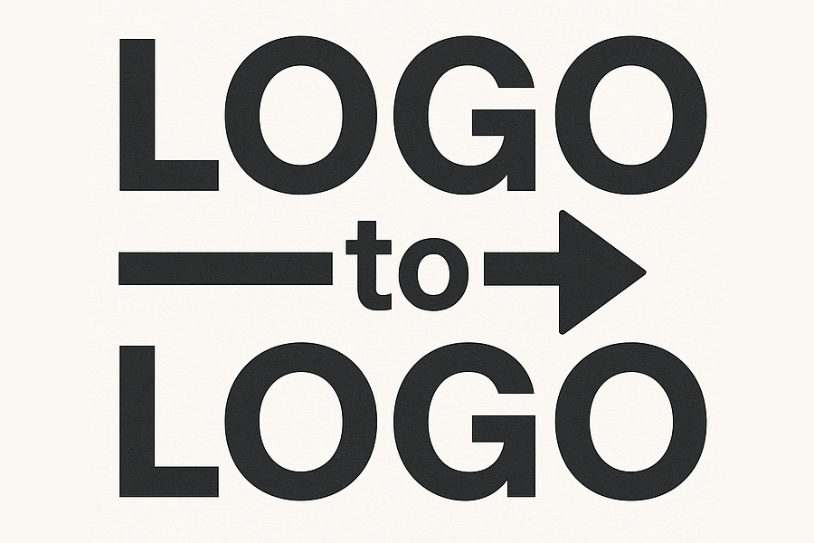

**OpenCV, YOLO 기반 로고 탐지 + 매장 위치 안내 GUI를 구현한 프로젝트**

## 소개
이 프로그램은 OpenCV와 YOLO를 이용하여 브랜드들의 로고를 인식하고 <br>

지도상에서 해당 사용자의 위치를 표시하고 원하는 브랜드 매장으로 길안내 프로그램입니다. <br>

이 프로젝트에서는 하남 스타필드 매장 구조와 입점한 브랜드들을 이용했습니다.<br>

---
## 📚 목차 (Table of Contents)
- [프로젝트 개요](#-프로젝트-개요)
- [1️⃣ YOLO 학습 과정](#1️⃣-yolo-학습-과정)
  - [1-1. 모델 선택 이유](#-1-1-모델-선택-이유)
  - [1-2. 학습 데이터 생성](#-1-2-학습-데이터-생성)
  - [1-3. YOLO 학습 방식](#-1-3-YOLO-학습-방식)
  - [1-4. 파인튜닝 전략](#-1-4-파인튜닝-전략)
- [2️⃣ 프로젝트 주요 기능](#2️⃣-프로젝트-주요-기능)
  - [2-1. 브랜드 로고 탐지](#-2-1-브랜드-로고-탐지)
  - [2-2. 매장 내부 구현 방식](#-2-2-매장-내부-구현-방식)
  - [2-3. 매장 위치 안내](#-2-3-매장-위치-안내)
- [프로젝트 구조](#-프로젝트-구조)
- [기술 스택](#-기술-스택) 
- [실행 화면](#-실행-화면)       
- [달성 성과](#-달성-성과)
- [향후 계획](#-향후-계획)
---

## 📌 프로젝트 개요

본 프로젝트는 **백화점 등 대형 매장에서 안내데스크를 거치지 않고 고객이 원하는 브랜드 매장이나 현재 위치을 쉽게 찾아주는** 시스템입니다. <br>

사용자가 촬영한 이미지나 영상 혹은 카메라를 통해 로고를 인식시키면 <br>

시스템이 이를 실시간으로 브랜드들로 인식하고 사용자의 현재 위치를 표시합니다. <br>

그리고 사용자가 원하는 브랜드를 선택 혹은 인식시키면 그 매장으로 길안내를 시작합니다.

---

## 1️⃣ YOLO 학습 과정

### 🔧 1-1. 모델 선택 이유

- 왜 YOLO인가?

| 아디다스 스포츠 | 아디다스 오리지널스 | 아디다스 매장간판 |
|---------------|----------------|----------------|
| 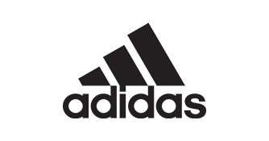 |  | 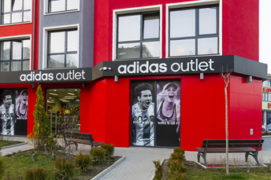 |

> 객체 인식 모델은 여러가지가 있지만 위 처럼 서로 다르지만 모두 Adidas로 인식을 하기위해 **YOLO** 모델을 선택했습니다.


- YOLOv8은 다양한 크기의 모델(n/s/m/l/x)을 제공하며, 본 프로젝트에서는 **YOLOv8s**를 선택했습니다.

| 모델 | 장점 | 단점 |
|------|------|------|
| YOLOv8n | 가장 빠름, 가벼움 | 정확도 낮음 |
| **YOLOv8s** | 속도와 정확도의 균형 | 실시간 탐지에 적합 |
| YOLOv8m/l/x | 정확도 높음 | 추론 속도 느림, 리소스 요구 높음 |

> YOLOv8s는 실내 환경에서도 빠르고 정확한 탐지를 지원하여 선택했습니다.

---
### 🏗️ 1-2. 학습 데이터 생성

- 약 200개 브랜드 로고에 대해 **합성 이미지 생성**

- **데이터 증강법 (data augmentation)**
1. 원본 이미지에서 특징적인 부분 추출
2. 추출한 이미지를 **homography** 를 이용하여상하좌우 왜곡
3. 추출 이미지와 왜곡 이미지를 다양한 배경과 합성 (매장, 거리, 테이블 등)
4. 랜덤 회전(±15°), 확대(1.3–1.5배) 등 적용

| 원본 | 추출 |
|---------------|----------------|
| 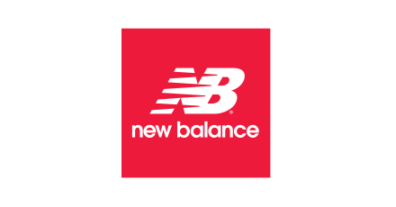 | 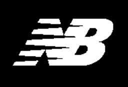 |

| 왜곡 | 합성 |
|---------------|----------------|
| 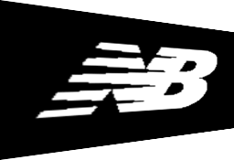 | 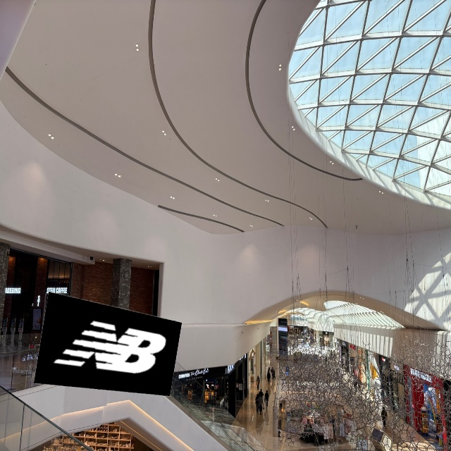 |

#### 왜곡 - homography.py 

```python
def apply_perspective(img, direction, ratio):
    # direction(top/bottom/left/right)에 따라 원근 변형 좌표 설정
    M = cv2.getPerspectiveTransform(src, dst)  # 변환 행렬 계산
    return cv2.warpPerspective(img, M, (w, h))  # 원근 변형 적용
```
```python
def generate():
    for logo_path in logo_paths:
        cleaned = clean_image(logo_path)  # 메타데이터 제거 및 RGBA 변환
        for direction in DIRECTIONS:
            warped = apply_perspective(logo, direction, ratio)
            cv2.imwrite(..., warped)  # 왜곡된 이미지 저장
```

#### 증강 - augmentation.py
```python
def rotate_image_no_crop(img, angle):
    # 이미지 회전 시 잘리지 않도록 크기 확장 후 회전 적용
    return cv2.warpAffine(img, M, (new_w, new_h))
```
```python
def place_logo_on_background(bg, logo):
    # 로고를 배경 위 무작위 위치에 합성
    # YOLO 형식 라벨 (x_center, y_center, width, height) 반환
    return composite, (x, y, w, h)
```
```python
def generate():
    for cls_name in class_to_images:
        for i in range(num_per_class):
            logo = rotate_image_no_crop(...)
            comp, label = place_logo_on_background(...)
            cv2.imwrite(...); write YOLO label to .txt  # 이미지 저장 및 라벨 작성
```

---

### 🧠 1-3. YOLO 학습 방식

- **YOLOv8s 모델 초기화:** `YOLO('yolov8s.pt')`
- **입력 해상도:** 640x640
- **에폭 수:** 100
- **검증용 데이터:** 클래스별 학습 이미지의 10~20%의 새로운 합성 이미지 생성해서 사용용
- **실제 영상으로 일반화 성능 테스트 수행**
- **YOLO** 학습 명령어 
```bash
yolo task=detect mode=train model=yolov8s.pt data=dataset/data.yaml epochs=100 imgsz=640
```
---

### 🔁 1-4. 파인튜닝 전략

- 일부 클래스가 실제 환경에서 탐지 성능 저하 → **클래스별 파인튜닝 수행**
- 기존 모델 유지한 채 **문제 클래스만 실제 로고로 재학습**
- 합성 + 실제 샘플 혼합으로 일반화 성능 개선
- 추후 **새로운 브랜드 학습시** 유용

---

## 2️⃣ 프로젝트 주요 기능

### 🔍 2-1. 브랜드 로고 탐지

- 촬영한 이미지나 비디오 혹은 실시간 카메라에서 브랜드 로고 탐지
- YOLOv8s 추론 결과 → 탐지된 클래스 ID 획득
- Tkinter GUI와 연동하여 로고 인식 결과 전송

---
### 🧱 2-2. 매장 내부 구현 방식

#### 1. 픽셀 단위 단순화
- 실제 매장 지도를 **고정 해상도 (예: 2400x800)** 로 단순화 및 픽셀화
- 각 픽셀은 **해당 위치의 의미를 가지는 색상**으로 채워짐
- 이 이미지는 `NumPy 배열`로 처리되어 경로 탐색 알고리즘에 사용

| 원본 | 단순화 |
|---------------|----------------|
| 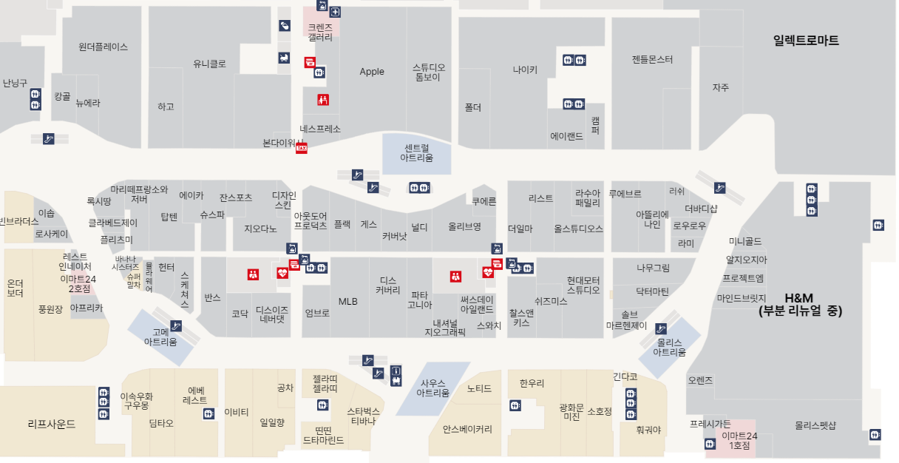 |  |

##### 입구 좌표 추출 - gate.py 
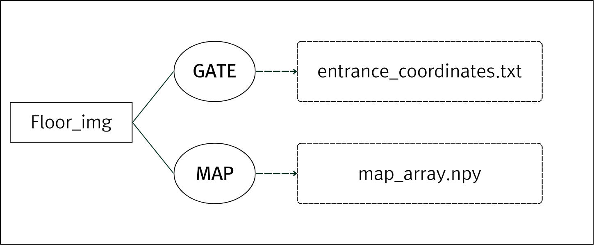
```python
# 빨간색 마스크 (입구 표시 색)
lower_red = np.array([0, 0, 200])
upper_red = np.array([50, 50, 255])
mask = cv2.inRange(img, lower_red, upper_red)

# 외곽선 중심 좌표 계산
for cnt in contours:
    M = cv2.moments(cnt)
    cx = int(M["m10"] / M["m00"])
    cy = int(M["m01"] / M["m00"])
    entrance_points.append((cx, cy)
```
```python
# y좌표 우선 내림차순 정렬 → Gate 번호와 연결
entrance_points.sort(key=lambda pt: (-pt[1], -pt[0]))

# 좌표 파일 저장
with open("entrance_coordinates.txt", "w") as f:
    for i, (x, y) in enumerate(entrance_points, 1):
        f.write(f"{i}: ({x}, {y})\n")
```
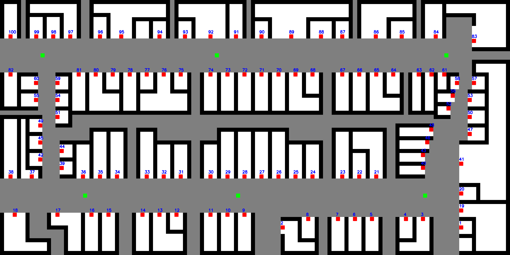

#### 2. 매장 내부 인식 및 색상별 구분 - map2.py

| 색상 | 의미 | 설명 | BGR 범위 기준 |
|------|------|------|------|
| WHITE | 매장 내부 | 각 브랜드 매장이 위치한 셀 | ([240, 240, 240], [255, 255, 255]) |
| BLACK | 벽 또는 장애물 | 경로 불가 영역 | ([0, 0, 0], [30, 30, 30]) |
| GRAY | 이동 가능 구역 | 사용자가 자유롭게 이동 가능한 공간 | ([100, 100, 100], [180, 180, 180]) |
| RED | 매장 입구 | 각 매장의 입구 | ([0, 150, 0], [100, 255, 100]) |
| GREEN | 에스컬레이터 | 다른층으로 이동하기 위한 공간 | ([0, 0, 200], [50, 50, 255]) |

- map2.py를 통해 각층의 이미지를 인식하고 색상별로 구분하여 그 정보를 `map_array_{floor}.npy`로 저장합니다.

```python
# 개별 마스크 생성
masks = {}
for color_name, (low, high) in color_ranges.items():
  masks[color_name] = cv2.inRange(img, np.array(low), np.array(high))
  print(f"  {color_name:<6} 검출 완료")

# 이동 불가 = 흰색 + 검정 + 빨강
blocked = cv2.bitwise_or(masks["WHITE"], masks["BLACK"])
blocked = cv2.bitwise_or(blocked, masks["RED"])

# 이동 가능 = 회색 + 초록
walkable = cv2.bitwise_or(masks["GRAY"], masks["GREEN"])

# 최종 맵 (1 = 이동 가능, 0 = 이동 불가능)
map_array = np.where(walkable > 0, 1, 0).astype(np.uint8)
```

```python
# numpy 파일로 저장
map_path = os.path.join(output_dir, f"map_array_{floor}.npy")
np.save(map_path, map_array)
```

#### 3. 실제 적용 예시
- 지도 이미지를 불러와 `cv2.resize()`로 축소 → 격자로 변환
- 각 픽셀 색상을 기준으로 의미를 판별하여 `2D 행렬(map_array)` 생성

#### 4. 활용 목적
- **GUI에서의 시각적 안내**와
- 추후 **경로 탐색 알고리즘**에서 구분을 위해 사용하기 위함

---

### 🗺️ 2-3. 현재 위치 와 인식한 브랜드 이름 표시

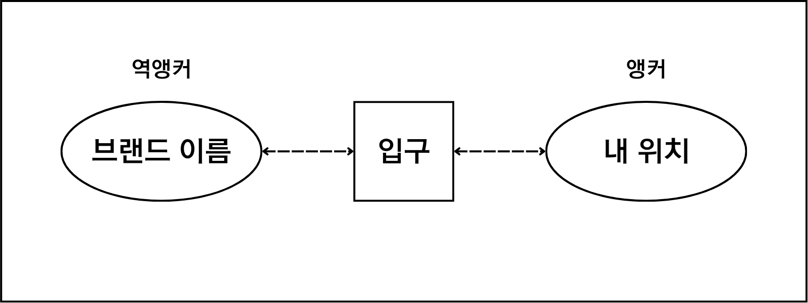

- `class2.cell`을 이용한 브랜드 ↔ 매장 ↔ 입구 정보 매핑
- Tkinter로 제작된 GUI 상에 **타원 영역으로 현재 위치 표시**
- gate2.py와 map2.py를 통해 각 매장의 입구 좌표와 번호 획득 및 사용
- 탐지된 브랜드 → 해당 매장 위치로 자동 포커스

##### 입구 방향 보정 (앵커 좌표 계산) - way2.py

```python
# 실행 시 인자로 받은 Gate 번호를 리스트로 저장합니다.
args = sys.argv[1:]
anchor_nums = [int(x) for x in args if x.isdigit()]
```
```python
# Gate 번호에 따라 해당 층(Floor) 을 자동 판별합니다.
def get_floor_from_gate(gate_num):
    if 1 <= gate_num <= 100: return "1F"
    elif 101 <= gate_num <= 178: return "2F"
    else: return "3F"
```
- YOLO_LOGO_{}.py를 통해 인식된 브랜드들의 Gate No와 Name 정보 저장하고 사용합니다.
```python
def shifted_anchor(x, y, direction="down"):
    # 입구 방향에 따라 앵커 방향을 설정
    offsets = {"down": 80, "up": 80, "left": 50, "right": 50}
    offset = offsets.get(direction, 0)
    return {
        "down": (x, y + offset),
        "up": (x, y - offset),
        "left": (x - offset, y),
        "right": (x + offset, y),
    }.get(direction, (x, y))
```
- 입구 좌표에서 일정 거리 떨어진 지점인 **앵커**를 이용해서 현재 위치를 계산 및 표시합니다.
```python
# 여러 입구 좌표 → 앵커 좌표 보정 → 평균 좌표 계산
if selected_anchors:
    avg_x = sum(x for x, _ in selected_anchors) // len(selected_anchors)
    avg_y = sum(y for _, y in selected_anchors) // len(selected_anchors)
elif entrances_current_floor:
    avg_x = sum(x for x, _ in entrances_current_floor) // len(entrances_current_floor)
    avg_y = sum(y for _, y in entrances_current_floor) // len(entrances_current_floor)
else:
    h, w, _ = img.shape
    avg_x, avg_y = w // 2, h // 2
```

##### 브랜드 이름 표시 (역 앵커 좌표 계산) - way2.py
```python
# ====== 역앵커 및 브랜드명 표시 ======
direction = number_to_way.get(gno, "down")
reverse_dir = {"up": "down", "down": "up", "left": "right", "right": "left"}[direction]
rx, ry = shifted_anchor(x, y, reverse_dir)
```
- 앵커의 반대 방향을 **역앵커** 로 지정하여 해당 좌표에 브랜드 매장명을 표시 했습니다.

## 📂 프로젝트 구조
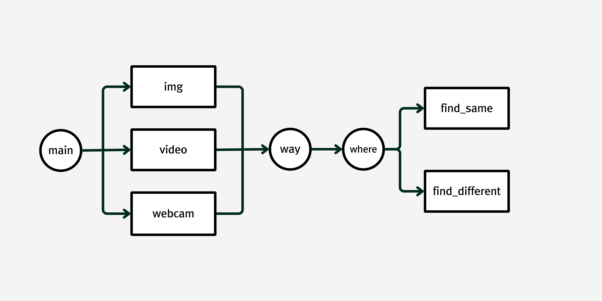
```plaintext
├── TermProject/
│   ├── codes/
│   |     ├── main.py
│   |     ├── YOLO_LOGO_img.py
│   |     ├── way.py
│   |     └── ...
│   ├── images/
│   |     ├── starfield 1F.png
│   |     ├── title.png
│   |     └── logo/
|   |          ├── adidas1.png
|   |          ├── starbucks.png
|   |          └── ...
|   ├── cells/
│   |     ├── class.cell
│   |     └── map.cell
|   ├── txts/
│   |     ├── entrance_coordinates.txt
│   |     └── map_array.npy         
│   └── best.pt 
```

---
## 🛠 기술 스택

| 분야 | 기술 스택 |
|------|-----------|
| 객체 탐지 | YOLOv8 (Ultralytics), OpenCV |
| 데이터 증강 | Python, NumPy, 이미지 왜곡/합성, YOLO 라벨 자동화 |
| GUI 구현 | Tkinter, OpenCV 기반 이미지 매핑 |
| 데이터 처리 | Pandas, Excel(.cell) 기반 입구/브랜드 매핑 |

---

## 🎥 실행 화면


-이미지 인식

-비디오 인식
---

## 🧪 달성 성과

- 총 40개 가량의 브랜드 로고에 대해 **인식** 성공 (합성 + 실제 촬영 데이터 기준)
- 테스트 영상 내에서도 **탐지된 브랜드의 매장 위치를 GUI 상에서 정확하게 포인팅**
- **여러 브랜드들을 인식했을 경우 각 매장의 앵커 좌표를 계산하여 현재 위치 표시** 구현 성공

---

## 🚀 향후 계획

- 📷 **지속적인 Fine-Tuning** → 탐지 정확도 향상 예정
- 🏬 **200개 가량의 브랜드까지 클래스 확장** 및 2F, 3F 등 다른 층도 확장 예정
- 📱 **원하는 매장으로 길찾기 내비게이션 기능 구현** 예정


